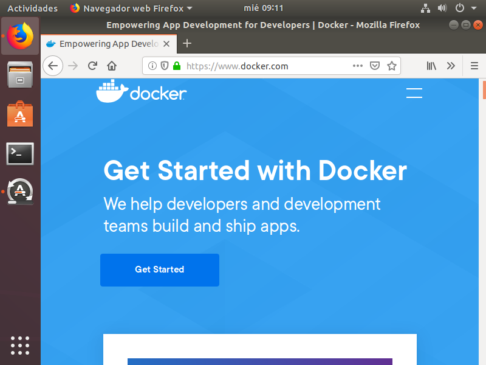
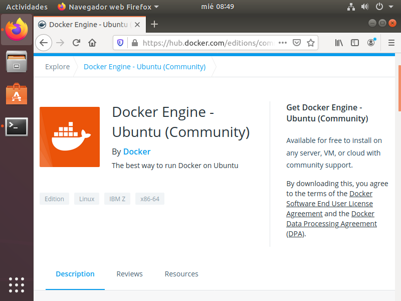
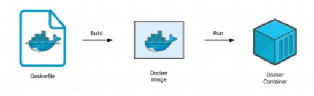

# INSTALACIÓN DE UN SGBD 
> Configuración previa  
> Para esta práctica en nuestro caso, usamos una imagen de **Ubuntu Desktop**, configuramos un adaptador puente con IPv4 fija. 

### Instalación de Docker

Docker se caracteriza porque automatiza el despliegue de[ aplicaciones](https://es.wikipedia.org/wiki/Aplicaci%C3%B3n_inform%C3%A1tica) dentro de[ contenedores de software](https://es.wikipedia.org/wiki/Contenedores_de_software). 

1. Descarga e instala Docker Desktop.

Primero nos dirigimos a la web de Docker  [https://www.docker.com/](https://www.docker.com/) . 

Una vez allí pulsamos en **Get Started**.

Elegimos la versión que queremos instalar y seguimos los pasos.

Instalación para Ubuntu.

Desinstalamos versiones antiguas. 

`` $ sudo apt-get remove docker docker-engine docker.io containerd runc`` 

Actualizar el índice de paquetes de apt e instale los paquetes para permitir a apt usar un repositorio sobre HTTPS: 

``$ sudo apt-get install \ apt-transport-https \ ca-certificates \ curl \ gnupg-agent \ software-properties-common``

Añadimos el repositorio oficial de Docker. 

`` $ curl -fsSL https://download.docker.com/linux/ubuntu/gpg | sudo apt-key add -``

2. Muestra por línea de comando y luego desde Docker Desktop las imágenes que  tienes descargada en Docker.

3. Descarga la última imagen de MySQL desde el hub de Docker por línea de  comandos. Indica en el documento que estás creando de  qué versión se trata.

4. Muestra de nuevo por línea de comando y luego desde Docker Desktop las  imágenes que tienes descargada en Docker.

5. La imagen por sí sola no hace nada, tendremos que crear un contenedor con dicha imagen. Por lo tanto, crea un contenedor mediante línea de comandos que ejecute el servidor de MySQL teniendo en cuenta que: 

*   Usaremos la imagen que acabamos de descargar. 
*   El servicio que arrancaremos al levantar este contenedor de MySQL deberá  tener el nombre ‘mysql&lt;versión>’. Esto nos ayudará luego para identificarlo  más rápido por si quisiéramos, por ejemplo, detener el servicio. 
*   Lo crearemos con la contraseña del usuario root ‘root’. 
*   Docker por defecto guarda la información en el interior del contenedor, por lo  que cuando eliminemos el contenedor, se eliminará dicha información.  Deberemos agregar en el comando la persistencia de datos hacia una carpeta  existente en nuestro PC local. 
*   Usaremos el puerto 3306 tanto del pc local como el del contenedor Docker.
*   Necesitaremos que el contenedor se esté ejecutando constantemente en  background (o fondo). 

6. Comprueba, mediante línea de comandos y desde Docker Desktop, que  contenedores están corriendo (status up). 

7. Si el servicio está corriendo, entra en MySQL y visualiza las bases de datos  existentes. 

#### Instalación de MySQL Workbench

8. Instala el cliente MySQL Workbench en el PC local y accede al servicio que hemos  arrancado (IP 127.0.0.1 -> localhost). 

9. Visualiza las bases de datos existentes en el servidor desde el cliente MySQL Workbench. 

10. Crea dos nuevas bases de datos desde la línea de comandos. 

11. Vuelve a visualizar las bases de datos existentes de las dos formas (línea de  comandos y cliente), para comprobar que se actualiza correctamente. 

12. Elimina una base de datos desde MySQL Workbench (mantén la otra). 

13. Vuelve a visualizar las bases de datos existentes de las dos formas (línea de  comandos y cliente), para comprobar que se actualiza correctamente. 

14. Sal de MySQL (exit;) 

15. Comprueba, mediante línea de comandos y desde Docker Desktop que 

contenedores están corriendo (status up). 

16. Para el contenedor de MySQL. 

17. Muestra todos los contenedores que tenemos, incluso los parados. 18. Intenta acceder a una tabla en MySQL Workbench ¿Qué ocurre? ¿Por qué? 19. Comprueba el estado de la carpeta local donde tenemos referenciado docker. 20. Elimina el contenedor y comprueba que los datos de la carpeta local del PC no se  han eliminado. 

21. Volver a crear el contenedor vinculandolo a la misma carpeta local y comprobar que mediante línea de comandos que vuelve a estar toda la información, incluida la base  de datos que hemos creado. 

22. Comprobar la conexión desde MySQL Workbench. 

### AMPLIACIÓN 

Instalar phpMyAdmin haciendo uso de Docker, teniendo en cuenta que hay que ‘lincarlo’ al servicio MySQL que ya hemos creado, sino irán como en servicios independientes y  no se podrá acceder desde phpMyAdmin a MySQL server. Una vez instalado, probar a abrir phpMyAdmin desde un navegador en local e  interactuar sobre las bases de datos.

## Referencias

*   [https://www.docker.com/](https://www.docker.com/)
*   [http://www.mysql.com](http://www.mysql.com)
*   [https://hub.docker.com](https://hub.docker.com)